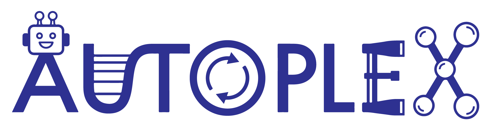

[](https://github.com/JaGeo/autoplex/actions/workflows/python-package.yml) [](https://doi.org/10.5281/zenodo.14105049)




`autoplex` is a software for generating and benchmarking machine learning (ML)-based interatomic potentials. The aim of `autoplex` is to provide a fully automated solution for creating high-quality ML potentials. The software is interfaced to multiple different ML potential fitting frameworks and to the atomate2 and ase environments for efficient high-throughput computations. The vision of this project is to allow a wide community of researchers to create accurate and reliable ML potentials for materials simulations.

`autoplex` is developed jointly by two research groups at BAM Berlin and the University of Oxford.

`autoplex` is an evolving project and **contributions are very welcome**! To ensure that the code remains of high quality, please raise a pull request for any contributions, which will be reviewed before integration into the main branch of the code. Initially, [@JaGeo](https://github.com/JaGeo) will handle the reviews.

# Documentation

You can find the `autoplex` documentation [here](https://autoatml.github.io/autoplex/index.html)!
The documentation also contains tutorials that teach you how to use `autoplex` for different use cases.

# Before you start using `autoplex`

We expect the general user of `autoplex` to be familiar with the [Materials Project](https://github.com/materialsproject) framework software tools and related
packages for (high-throughput) workflow submission and management.
This involves the following software packages:
- [pymatgen](https://github.com/materialsproject/pymatgen) for input and output handling of computational materials science software
- [atomate2](https://github.com/materialsproject/atomate2) for providing a library of pre-defined computational materials science workflows
- [jobflow](https://github.com/materialsproject/jobflow) for processes, job and workflow handling
- [jobflow-remote](https://github.com/Matgenix/jobflow-remote) or [FireWorks](https://github.com/materialsproject/fireworks) for workflow and database (MongoDB) management
- [MongoDB](https://www.mongodb.com/) as the database (we recommend installing the MongoDB community version)

All of these software tools provide documentation and tutorials. Please take your time and check everything out!

# Setup

To set up the mandatory prerequisites for using `autoplex,` please follow the [installation guide of atomate2](https://materialsproject.github.io/atomate2/user/install.html).

After setting up `atomate2`, make sure to add `VASP_INCAR_UPDATES: {"NPAR": number}` in your ~/atomate2/config/atomate2.yaml file.
Set a number that is a divisor of the number of tasks you use for the VASP calculations.

# Installation

### Python version

Before the installation, please make sure that you are using one of the supported Python versions (see [pyproject.toml](https://github.com/autoatml/autoplex/blob/main/pyproject.toml))

### Standard installation

Please install `autoplex` using ``pip install git+https://github.com/autoatml/autoplex.git``. This will install all the Python packages and dependencies needed for MLIP fits. We will release a version of `autoplex` to PyPI in the next few weeks.

Additionally, to fit and validate `ACEpotentials`, one also needs to install Julia, as Autoplex relies on [ACEpotentials](https://acesuit.github.io/ACEpotentials.jl/dev/gettingstarted/installation/), which supports fitting of linear ACE. Currently, no Python package exists for the same.
Please run the following commands to enable the `ACEpotentials` fitting options and further functionality.

Install Julia v1.9.2

```bash
curl -fsSL https://install.julialang.org | sh -s -- default-channel 1.9.2
```

Once installed in the terminal, run the following commands to get Julia ACEpotentials dependencies.

```bash
julia -e 'using Pkg; Pkg.Registry.add("General"); Pkg.Registry.add(Pkg.Registry.RegistrySpec(url="https://github.com/ACEsuit/ACEregistry")); Pkg.add(Pkg.PackageSpec(;name="ACEpotentials", version="0.6.7")); Pkg.add("DataFrames"); Pkg.add("CSV")'
```

### Enabling RSS workflows

Additionally, `buildcell` as a part of `AIRSS` needs to be installed if one wants to use the RSS functionality:

```bash
curl -O https://www.mtg.msm.cam.ac.uk/files/airss-0.9.3.tgz; tar -xf airss-0.9.3.tgz; rm airss-0.9.3.tgz; cd airss; make ; make install ; make neat; cd ..
```

### Contributing guidelines / Developer's installation

A short guide to contributing to autoplex can be found [here](https://autoatml.github.io/autoplex/dev/contributing.html). Additional information for developers can be found [here](https://autoatml.github.io/autoplex/dev/dev_install.html).

# Workflow overview

We currently have two different types of automation workflows available:

* Workflow to use random-structure searches for the systematic construction of interatomic potentials. The implementation automates ideas from the following articles: [*Phys. Rev. Lett.* **120**, 156001 (2018)](https://journals.aps.org/prl/abstract/10.1103/PhysRevLett.120.156001) and [*npj Comput. Mater.* **5**, 99 (2019)](https://www.nature.com/articles/s41524-019-0236-6).
* Workflow to train accurate interatomic potentials for harmonic phonon properties. The implementation automates the ideas from the following article: [*J. Chem. Phys.* **153**, 044104 (2020)](https://pubs.aip.org/aip/jcp/article/153/4/044104/1056348/Combining-phonon-accuracy-with-high).
