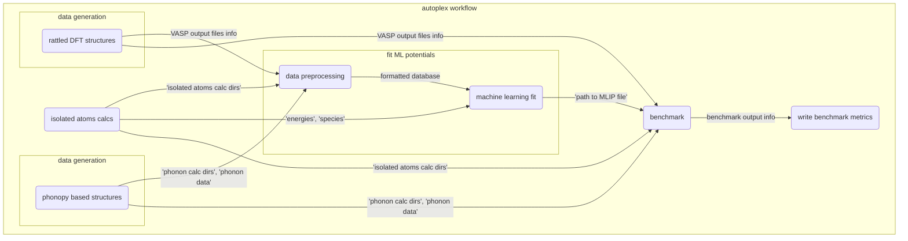

[](https://github.com/JaGeo/autoplex/actions/workflows/python-package.yml)
# autoplex

`autoplex` is a software for generating and benchmarking machine learning (ML) based interatomic potentials. The aim of `autoplex` is to provide a fully automated solution for creating high-quality ML potentials. The software is interfaced to multiple different ML potential fitting frameworks and to the atomate2 and ase environment for efficient high-throughput computations. The vision of this project is to allow a wide community of researchers to create accurate and reliable ML potentials for materials simulations.

`autoplex` is developed jointly by two research groups at BAM Berlin and the University of Oxford.

`autoplex` is an evolving project and **contributions are very welcome**! To ensure that the code remains of high quality, please raise a pull request for any contributions, which will be reviewed before integration into the main branch of the code. In the beginning, Janine will take care of the reviews.

# General code structure
- We are currently aiming to follow the code structure below for each submodule (This is an initial idea; of course, this could change depending on the needs in the future)
  - autoplex/submodule/job.py (any jobs defined will be inside this module)
  - autoplex/submodule/flows.py (workflows defined will be hosted in this module)
  - autoplex/submodule/utils.py (all functions that act as utilities for defining flow or job, for example, a small subtask to calculate some metric or plotting, will be hosted in this module)

# Guidelines for contributions
- Please write unit tests; this is a requirement for any added code to be accepted. (Automated testing will be performed using `pytest`; you can look into the `tests` folder for examples).
- Please ensure high coverage of the code based on the tests (you can test this with `coverage`).
- Please use numpy docstrings (use an IDE and switch on this docstring type; you can check examples in our code base; the docstring should be useful for other people)
- Please ensure that type hints are added for each variable, function, class, and method (this helps code readability, especially if someone else wants to build on your code).
- Please write the code in a way that gives users the option to change parameters (this is mainly applicable, for example, fitting protocols/flows). In other words, please avoid hardcoding settings or physical properties. Reasonable default values should be set, but the user needs to have the opportunity to modify them if they wish.

# Formatting requirements
- Variable names should be descriptive and should use snake case (`variable_name`, not `VariableName`).
- If you define a `Maker`, please use python class naming convention (e.g., `PhononMaker`, `RssMaker`).

# Commit guidelines
1. `pip install pre-commit`.
2. Next, run `pre-commit install` (this will install all the hooks from pre-commit-config.yaml)
3. Step 1 and 2 needs to be done only once in the local repository
4. Proceed with modifying the code and adding commits as usual. This should automatically run the linters.
5. To manually run the pre-commit hooks on all files, just use `pre-commit run --all-files`
6. To run pre-commit on a specific file, use `pre-commit run --files path/to/your/modified/module/`

Please check out atomate2 for example code (https://github.com/materialsproject/atomate2)

# Setup

In order to setup the mandatory prerequisites to be able to use `autoplex`, please follow the [installation guide of atomate2](https://materialsproject.github.io/atomate2/user/install.html).

After setting up `atomate2`, make sure to add `VASP_INCAR_UPDATES: {"NPAR": number}` in your ~/atomate2/config/atomate2.yaml file.
Set a number that is a divisor of the number of tasks you use for the VASP calculations.

# Installation
autoplex relies on the atomate2 and ase frameworks.

Developers installation: Navigate to autoplex and install it by `pip install -e .[docs,strict,dev]`.

Alternatively, the dependencies atomate2 and ase can be installed individually via
```bash
pip install atomate2[strict]

pip install ase@git+https://gitlab.com/ase/ase.git@aae51d57721847624cea569f3a2d4bb6aa5032b4
```

Additionally, to be able to fit and validate `ACEpotentials`, one also needs to install julia as autoplex relies on [ACEpotentials](https://acesuit.github.io/ACEpotentials.jl/dev/gettingstarted/installation/) which support fitting of linear ACE and currently no python package exists for the same.
Please run following commands to enable ACEpotentials fitting and functionality.

Install julia
`curl -fsSL https://install.julialang.org | sh`

Once installed, in terminal run `julia` and then run the following commands

```jl
using Pkg
Pkg.activate(".")
Pkg.Registry.add("General")  # only needed when installing Julia for the first time
Pkg.Registry.add(RegistrySpec(url="https://github.com/ACEsuit/ACEregistry"))
Pkg.add("ACEpotentials")
Pkg.add("DataFrames")
Pkg.add("CSV")
```

# Workflow overview

The following [Mermaid](https://mermaid.live/) diagram will give you an overview of the flows and jobs in the default autoplex workflow:

The workflow starts with three flows that generate data for our database:
* The first flow is preparing the VASP calculation for the isolated atoms (`isolated atoms calcs`).
* A second flow is preparing the `phonopy` calculations to collect the VASP data from the single-atom displaced supercells (`phonopy based structures`).
* The third flow is constructing rattled supercells by rattling the atoms, i.e. displacing all atoms' positions (in the default setup), preparing the VASP calculations and collecting the data for the MLIP fit (`rattled DFT structures`).

After a few data preprocessing steps (`data preprocessing`) to filter out data with too strong force values, the MLIP fit (`machine learning fit`) is run and the resulting potential is used for the benchmark against DFT data (`benchmark`).
Finally, the result metrics are collected in form of output plots and files (`write benchmark metrics`).
