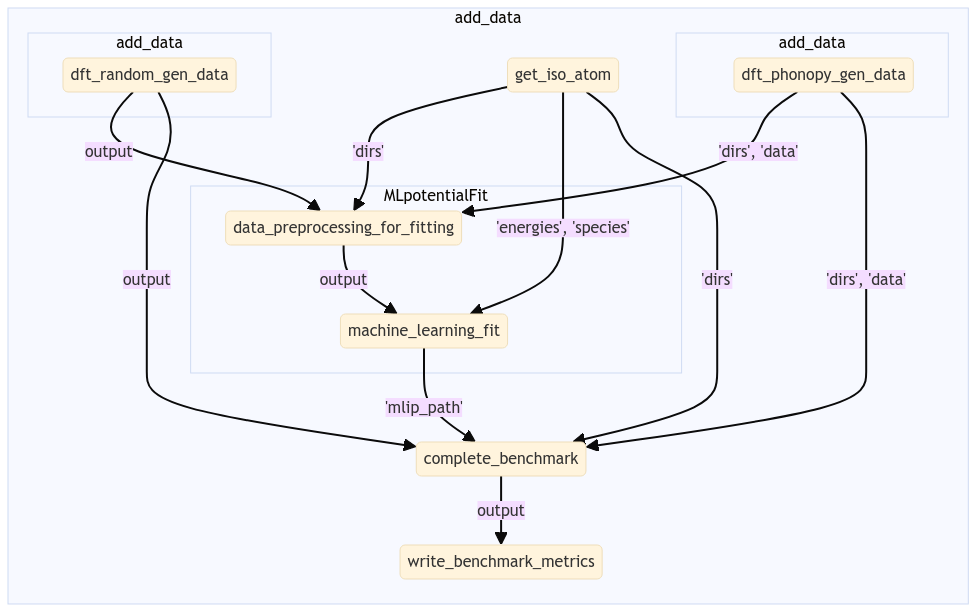

(flows)=

# Out of the box workflow

This tutorial will demonstrate how to use `autoplex` with its default setup and settings.

> ℹ️ The default setting might not be sufficient or not suitable in any other way for your calculations. Carefully check your results with the default setup and adjust the settings when needed.

## General workflow

The complete workflow of `autoplex` involves the data generation (including the execution of VASP calculations), the fitting of the  machine-learned interatomic potential (MLIP) and the benchmark to the DFT results.

Let us start by importing all the necessary modules:

```python
from jobflow.core.flow import Flow
from mp_api.client import MPRester
from autoplex.auto.phonons.flows import CompleteDFTvsMLBenchmarkWorkflow
```
We will use [jobflow](https://github.com/materialsproject/jobflow) to control the execution of our jobs in form of flows and jobs.
Using the `MPRester` is a convenient way to draw structures from the Materials Project database using their MP-ID.
The only module we need to import from `autoplex` is the `CompleteDFTvsMLBenchmarkWorkflow`.


Next, we are going to construct the workflow based on the rocksalt-type LiCl ([*mp-22905*](https://next-gen.materialsproject.org/materials/mp-22905?material_ids=mp-22905)). 

```python
mpr = MPRester(api_key='YOUR_MP_API_KEY')
structure_list = []
benchmark_structure_list = []
mpids = ["mp-22905"]  
# you can put as many mpids as needed e.g. mpids = ["mp-22905", "mp-1185319"] for all LiCl entries in the Materials Project
mpbenchmark = ["mp-22905"]
for mpid in mpids:
    structure = mpr.get_structure_by_material_id(mpid)
    structure_list.append(structure)
for mpbm in mpbenchmark:
    bm_structure = mpr.get_structure_by_material_id(mpbm)
    benchmark_structure_list.append(bm_structure)

complete_flow = CompleteDFTvsMLBenchmarkWorkflow().make(
    structure_list=structure_list, mp_ids=mpids, 
    benchmark_structures=benchmark_structure_list, benchmark_mp_ids=mpbenchmark)

autoplex_flow = Flow([complete_flow], name="tutorial", output=None, uuid=None, hosts=None)
```
The only default information we need to provide is which structures we want to calculate and use for the MLIP fitting and which structures we want to benchmark to.

The following diagram will give you an overview of the flows and jobs in the default autoplex workflow:

The workflow starts with three flows that are supposed to add data to our database: The first flow is preparing the VASP calculation for the isolated atoms (`get_iso_atom`). A second flow is preparing the `phonopy` calculations to collect the VASP data from the single-atom displaced supercells (`dft_phonopy_gen_data`). The third flow is constructing randomized supercells by rattling the atoms, i.e. displacing all atoms' positions (in the default setup), preparing the VASP calculations and collecting the data for the MLIP fit (`dft_random_gen_data`).
After a few data preprocessing steps (`data_preprocessing_for_fitting`) to filter out data with too strong force values, the MLIP fit (`machine_learning_fit`) is run and the resulting potential is used for the benchmark against DFT data (`complete_benchmark`).
Finally, the result metrics are collected in form of output plots and files (`write_benchmark_metrics`). The lines connecting two flows or jobs are showing what type of data is passed on to the next step.

The workflow is easy to customize and every aspect of the workflow (data generation, MLIP fit, benchmark) is in the control of the user.

## Output and results

The default `autoplex` workflow provides you with diagnostic and benchmark output plots and results. Please note that the current shown results are the autoplex unit test examples and have not been produced by the tutorial settings.

After the MLIP fit is finished, `autoplex` outputs the training and the testing error of the current potential that is fitted.

```bash
Training error of MLIP (eV/at.): 0.0049634
Testing error of MLIP (eV/at.): 0.0023569
```

"MLIP vs. DFT" plots for the energy and force values will be automatically saved which provides you with information about the quality of your fit.

The plot is divided into three sections. First, the energies and forces for the training data, and then for the test data is plotted. `autoplex` also automatically filters the data according to a certain energy threshold (eV) `energy_limit=0.005` as well as a certain force threshold (ev/Å) `force_limit=0.1` to catch outliers resulting from inconsitencies in the data.
Finally, the energy and force filtered data is plotted in the third section. This can help you to figure out if there is a problem with your data in case the MLIP fit quality does not turn out as expected.

At the end of each workflow run, `autoplex` also provides you with the benchmark plots for the phonon bandstructure comparison between the ML-based (self) and the DFT-based (other) result,  


as well as the q-point wise phonon RMSE plot.

This will give you feedback of the overall quality of the generated ML potential.

`autoplex` also prints the file `results_LiCl.txt` (here for the example of LiCl) with a summary of the essential results of your workflow setup.
```text
Potential  Structure  MPID        Displacement (Å)  RMSE (THz)  Hyperparameters (atom-wise f, n_sparse, SOAP delta)    imagmodes(pot)  imagmodes(dft)
GAP        LiCl       mp-22905    0.01              0.47608     {'f=0.1': 'default'}                                   False           False
```

