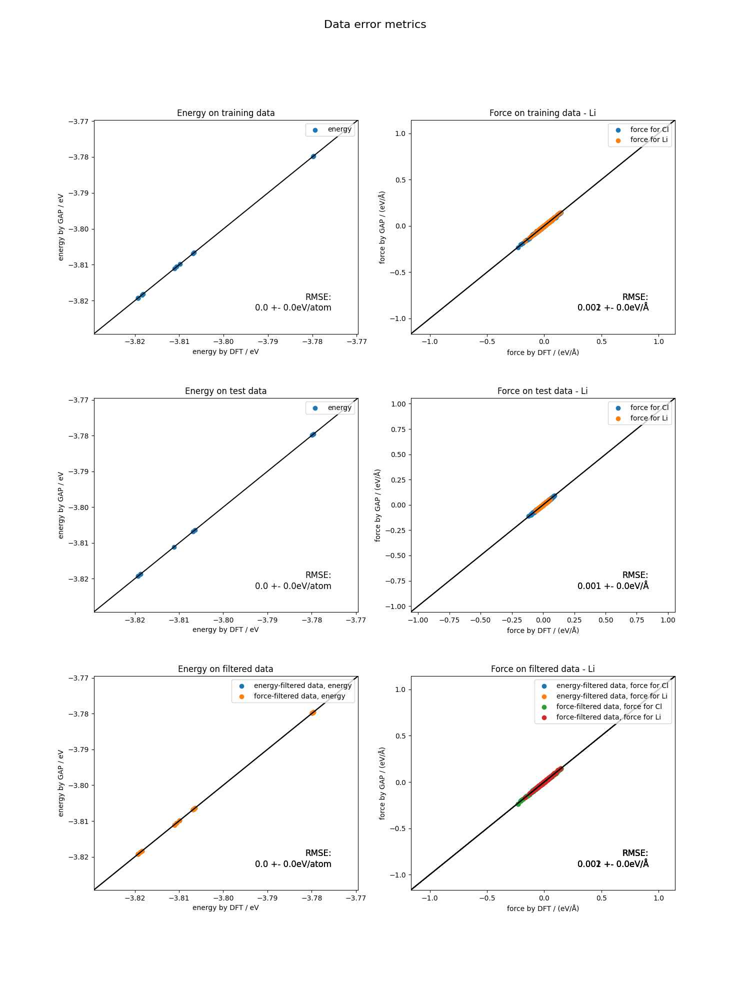
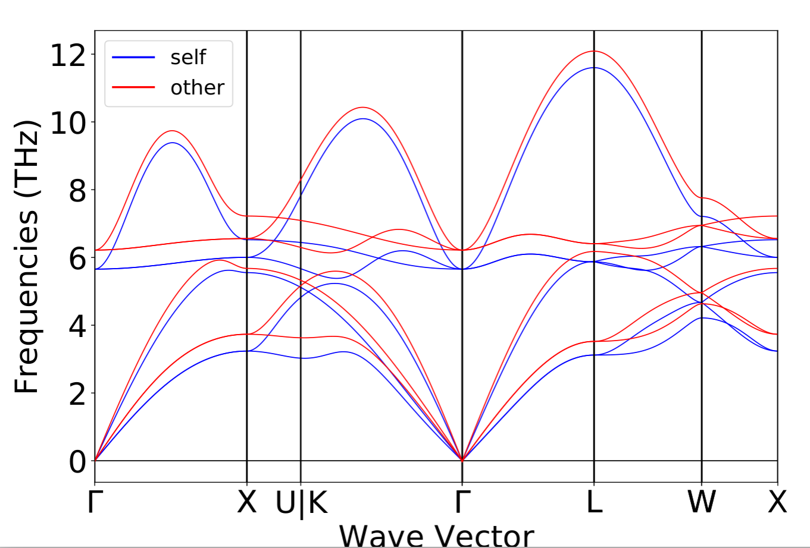
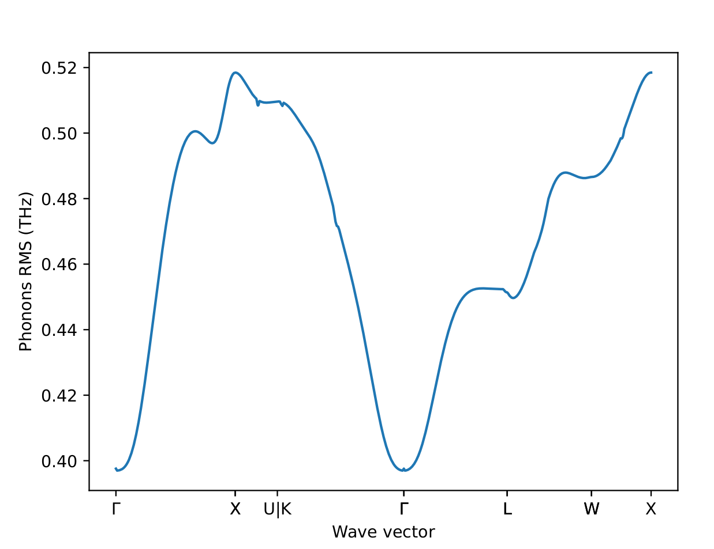

(flows)=

# Out-of-the-box workflow

## Phonon-accurate machine-learned potentials workflow

This tutorial will demonstrate how to use `autoplex` with its default setup and settings.

> ℹ️ The default setting might not be sufficient or not suitable in any other way for your calculations. Carefully check your results with the default setup and adjust the settings when needed.

## General workflow

The complete workflow of `autoplex` involves the data generation 
(including the execution of VASP calculations), 
the fitting of the machine-learned interatomic potential (MLIP) and the benchmark to the DFT results. 

We also have an iterative version of this workflow that reruns the complete workflow until a certain quality of the phonons is reached. It is described below.

### Before running the workflow

As a first step, you should check if our algorithm can generate supercells that are small enough to be treated with DFT 
(not too many atoms) and large enough to result into reliable phonon properties.
To do so, you can use the following function:

```python
from mp_api.client import MPRester
from autoplex.data.phonons.utils import check_supercells


# first you can download structures from the Materials Project
mpr = MPRester(api_key='YOUR_MP_API_KEY')
structure_list = []

mpids = ["mp-149","mp-165","mp-168","mp-16220","mp-571520","mp-971661","mp-971662","mp-999200", "mp-1072544", "mp-1079297", "mp-1095269", "mp-1200830", "mp-1203790"]
for mpid in mpids:
    structure = mpr.get_structure_by_material_id(mpid)
    structure_list.append(structure)


# then you can use the check_supercells function
check_supercells(structure_list, mpids, min_length=18, max_length=25, fallback_min_length=10, min_atoms=100, max_atoms=500, tolerance=0.1)
```

`check_supercells` will list all structures that should likely be excluded. 
However, please carefully check yourself as your local memory requirements might be different.
Remove all structures which you cannot treat computationally 
(e.g., structures with lattice parameters larger than 25 Å or more than 500 atoms).

Using the `MPRester` is a convenient way to draw structures from the Materials Project database using their MP-ID.


### Test DFT run times and memory requirements

To get a rough estimate of DFT requirements for the supercells that you have chosen, you can use the `DFTSupercellSettingsMaker` 
to test the DFT run times for an undisplaced supercell of a similar size to the ones we will use in the overall workflow. 

```python
from jobflow.core.flow import Flow
from mp_api.client import MPRester
from autoplex.auto.phonons.flows import DFTSupercellSettingsMaker

mpr = MPRester(api_key='YOUR_MP_API_KEY')
structure_list = []
benchmark_structure_list = []
mpids = ["mp-22905"]  
# you can put as many mpids as needed e.g. mpids = ["mp-22905", "mp-1185319"] for all LiCl entries in the Materials Project
mpbenchmark = ["mp-22905"]
for mpid in mpids:
    structure = mpr.get_structure_by_material_id(mpid)
    structure_list.append(structure)
for mpbm in mpbenchmark:
    bm_structure = mpr.get_structure_by_material_id(mpbm)
    benchmark_structure_list.append(bm_structure)

dft_supercell_check_flow = DFTSupercellSettingsMaker().make(
    structure_list=structure_list, mp_ids=mpids)

dft_supercell_check_flow.name = "tutorial"
autoplex_flow = dft_supercell_check_flow
```

This will allow you to check whether memory requirements on your supercomputers are enough and if you might need to switch to smaller systems.


## Now start the workflow
We will use [jobflow](https://github.com/materialsproject/jobflow) to control the execution of our jobs in form of flows and jobs.
The only module we need to import from `autoplex` is the `CompleteDFTvsMLBenchmarkWorkflow`.


Next, we are going to construct the workflow based on the rocksalt-type LiCl ([*mp-22905*](https://next-gen.materialsproject.org/materials/mp-22905?material_ids=mp-22905)). 
Remember to replace `YOUR_MP_API_KEY` with your personal [Materials Project API key](https://next-gen.materialsproject.org/api#api-key).

```python
from mp_api.client import MPRester
from autoplex.auto.phonons.flows import CompleteDFTvsMLBenchmarkWorkflow

mpr = MPRester(api_key='YOUR_MP_API_KEY')
structure_list = []
benchmark_structure_list = []
mpids = ["mp-22905"]  
# you can put as many mpids as needed e.g. mpids = ["mp-22905", "mp-1185319"] for all LiCl entries in the Materials Project
mpbenchmark = ["mp-22905"]
for mpid in mpids:
    structure = mpr.get_structure_by_material_id(mpid)
    structure_list.append(structure)
for mpbm in mpbenchmark:
    bm_structure = mpr.get_structure_by_material_id(mpbm)
    benchmark_structure_list.append(bm_structure)

complete_flow = CompleteDFTvsMLBenchmarkWorkflow(
    apply_data_preprocessing=True,
).make(
    structure_list=structure_list, mp_ids=mpids, 
    benchmark_structures=benchmark_structure_list, benchmark_mp_ids=mpbenchmark)

complete_flow.name = "tutorial"
autoplex_flow = complete_flow
```
The only default information we need to provide is which structures we want to calculate and use for the MLIP fitting 
and which structures we want to benchmark to.
The `autoplex` workflow will then perform automated VASP and `phonopy` calculations, MLIP fits, and benchmarks.
Of course, you can change and adjust the settings to your own needs, e.g. by setting a smaller supercell for the 
`phonopy` calculations using `CompleteDFTvsMLBenchmarkWorkflow(min_length=15).make(...)`. 
You can find more details on the subsequent tutorial pages.
With additional flows or jobs in the `[complete_flow]` list, 
you can combine the `autoplex` flow with other flows and jobs.
As the `mp_id` parameter is a string, you can also use any other *unique* structure object identifier instead.

The following workflow diagram will give you an overview of the flows and jobs in the default autoplex workflow:
```{mermaid}
flowchart TD
    becfe032-c5ca-4398-9691-0f16baacb237(external) -->|'rattled_dir'| 42331e94-129c-45ef-9116-770369f6eab1(data_preprocessing_for_fitting)
    becfe032-c5ca-4398-9691-0f16baacb237(external) -->|'rattled_dir'| 56cb031a-0cd7-4aa5-b857-c2c4d17e86c4(complete_benchmark_mp-22905)
    a0286b49-988f-4628-8da6-270caade44bc(external) -->|'phonon_dir', 'phonon_data'| 42331e94-129c-45ef-9116-770369f6eab1(data_preprocessing_for_fitting)
    a0286b49-988f-4628-8da6-270caade44bc(external) -->|'phonon_dir', 'phonon_data'| 56cb031a-0cd7-4aa5-b857-c2c4d17e86c4(complete_benchmark_mp-22905)
    3b147b9e-05ff-4823-9dbc-7f8855fa99b5(external) -->|'dirs'| 42331e94-129c-45ef-9116-770369f6eab1(data_preprocessing_for_fitting)
    3b147b9e-05ff-4823-9dbc-7f8855fa99b5(external) -->|'species', 'energies'| e0655654-19da-4c19-9e4e-d2a4014084db(machine_learning_fit)
    3b147b9e-05ff-4823-9dbc-7f8855fa99b5(external) -->|'dirs'| 56cb031a-0cd7-4aa5-b857-c2c4d17e86c4(complete_benchmark_mp-22905)
    42331e94-129c-45ef-9116-770369f6eab1(data_preprocessing_for_fitting) -->|output| e0655654-19da-4c19-9e4e-d2a4014084db(machine_learning_fit)
    e0655654-19da-4c19-9e4e-d2a4014084db(machine_learning_fit) -->|'mlip_path'| 56cb031a-0cd7-4aa5-b857-c2c4d17e86c4(complete_benchmark_mp-22905)
    56cb031a-0cd7-4aa5-b857-c2c4d17e86c4(complete_benchmark_mp-22905) -->|output| 56e6d111-8da3-4ae6-a69c-33632121a3d7(write_benchmark_metrics)
    becfe032-c5ca-4398-9691-0f16baacb237(rattled supercells_mp-22905)
    a0286b49-988f-4628-8da6-270caade44bc(single-atom displaced supercells_mp-22905)
    3b147b9e-05ff-4823-9dbc-7f8855fa99b5(get_iso_atom)
    subgraph 5f9b5d90-8fe0-418b-a90a-6c39371b8e04 [MLpotentialFit]
        42331e94-129c-45ef-9116-770369f6eab1(data_preprocessing_for_fitting)
        e0655654-19da-4c19-9e4e-d2a4014084db(machine_learning_fit)
    end
    56cb031a-0cd7-4aa5-b857-c2c4d17e86c4(complete_benchmark_mp-22905)
    56e6d111-8da3-4ae6-a69c-33632121a3d7(write_benchmark_metrics)
```
The workflow starts with three flows that are supposed to generate data for our database: 
* The first flow is preparing the VASP calculation for the isolated atoms (`get_iso_atom`). 
* A second flow is preparing the `phonopy` calculations to collect the VASP data from the single-atom displaced supercells (`single-atom displaced supercells_mp-22905`). 
* The third flow is constructing rattled supercells by rattling the atoms, i.e. displacing all atoms' positions (in the default setup), preparing the VASP calculations and collecting the data for the MLIP fit (`rattled supercells_mp-22905`).

After a few data preprocessing steps (`data_preprocessing_for_fitting`) to filter out data with too strong force values, 
the MLIP fit (`machine_learning_fit`) is run and the resulting potential is used for the benchmark against DFT data 
(`complete_benchmark_mp-22905`).

Finally, the result metrics are collected in form of output plots and files (`write_benchmark_metrics`). 
The lines connecting two flows or jobs are showing what type of data is passed on to the next step, like "data", "dirs" or "output". 
"Output" is a generic name for the several job outputs, e.g. the output of `rattled supercells_mp-22905` contains where 
`data_preprocessing_for_fitting` can find the files it needs for the MLIP fit. 
"Data" contains the [phonon calculation task documents](https://materialsproject.github.io/atomate2/reference/atomate2.common.schemas.phonons.PhononBSDOSDoc.html#atomate2.common.schemas.phonons.PhononBSDOSDoc) and "dirs" contains the path to the directory where the jobs 
were executed.
"Energies" and "species" are isolated atoms' energies and a list of species used, and "mlip_path" is the path to the MLIP fit files.

The workflow diagram was automatically generated using [Mermaid](https://mermaid.live/) and the job connection data collected by `jobflow` 
for a simple job default setup with only one MP-ID.
You can add the following lines to your `autoplex` submission script to generate the specific Mermaid diagram for your 
own workflow setup:
```python
from jobflow.utils.graph import to_mermaid

...

autoplex_flow = ...

graph_source = to_mermaid(autoplex_flow, show_flow_boxes=True)
print(graph_source)  # show mermaid graph
```
Then you can paste the printed text to the [Mermaid Live Online FlowChart & Diagrams Editor](https://mermaid.live/). 

The `autoplex` workflow is easy to customize and every aspect of the workflow (data generation, MLIP fit, benchmark) is 
in the control of the user as demonstrated in the subsequent tutorial pages.


## Output and results

The default `autoplex` phonon workflow provides you with diagnostic and benchmark output plots and results. 
Please note that the current shown results are the autoplex unit test examples and have not been produced by the tutorial settings.

After the MLIP fit is finished, `autoplex` outputs the training and the testing error of the current potential that is fitted.

```bash
Training error of MLIP (eV/at.): 0.0049634
Testing error of MLIP (eV/at.): 0.0023569
```

"MLIP vs. DFT" plots for the energy and force values will be automatically saved which provides you with information 
about the quality of your fit.

The plot is divided into three sections. First, the energies and forces for the training data, and then for the test data is plotted. `autoplex` also automatically filters the data according to a certain energy threshold (eV) `energy_limit=0.005` as well as a certain force threshold (ev/Å) `force_limit=0.1` to catch outliers resulting from inconsistencies in the data.
Finally, the energy and force filtered data is plotted in the third section. This can help you to figure out if there is 
a problem with your data in case the MLIP fit quality does not turn out as expected.

At the end of each workflow run, `autoplex` also provides you with the benchmark plots for the phonon bandstructure 
comparison between the ML-based (here GAP) and the DFT-based result.  



as well as the q-point wise phonon RMSE plot.

This will give you feedback of the overall quality of the generated ML potential.

`autoplex` also prints the file `results_LiCl.txt` (here for the example of LiCl) with a summary of the essential 
results of your workflow setup.
```text
Potential  Structure  MPID        Displacement (Å)  RMSE (THz)  imagmodes(pot)  imagmodes(dft)  Database type   (Hyper-)Parameters
GAP        LiCl       mp-22905    0.01              0.57608     False           False           full            atom-wise f=0.1: n_sparse = 6000, SOAP delta = 0.5
```

## Iterative version of the default workflow

To systematically converge the quality of the potentials, we have built an iterative version of the default workflow `CompleteDFTvsMLBenchmarkWorkflow`. It will run the `CompleteDFTvsMLBenchmarkWorkflow` until the worst RMSE value of the benchmark structures falls under a certain value or a maximum number of repetitions is reached.

We allow users in the first generation to use a slightly different  workflow than in the subsequent generations. This can help to initially obtain enough structures for an MLIP fit and only slightly increase the number of structures in the next generations. Please don't forget to deactivate the phonon data generation after the first iteration.

```python
from mp_api.client import MPRester
from autoplex.auto.phonons.flows import CompleteDFTvsMLBenchmarkWorkflow, IterativeCompleteDFTvsMLBenchmarkWorkflow

mpr = MPRester(api_key='YOUR_MP_API_KEY')
structure_list = []
benchmark_structure_list = []
mpids = ["mp-22905"]  
# you can put as many mpids as needed e.g. mpids = ["mp-22905", "mp-1185319"] for all LiCl entries in the Materials Project
mpbenchmark = ["mp-22905"]
for mpid in mpids:
    structure = mpr.get_structure_by_material_id(mpid)
    structure_list.append(structure)
for mpbm in mpbenchmark:
    bm_structure = mpr.get_structure_by_material_id(mpbm)
    benchmark_structure_list.append(bm_structure)

complete_flow=IterativeCompleteDFTvsMLBenchmarkWorkflow(rms_max=0.2, max_iterations=4, 
                                                        complete_dft_vs_ml_benchmark_workflow_0=CompleteDFTvsMLBenchmarkWorkflow(
    apply_data_preprocessing=True, add_dft_phonon_struct=True,
), 
                                                        complete_dft_vs_ml_benchmark_workflow_1=CompleteDFTvsMLBenchmarkWorkflow(
    apply_data_preprocessing=True, add_dft_phonon_struct=False,
)
                                                        ).make(
    structure_list=structure_list, mp_ids=mpids, 
    benchmark_structures=benchmark_structure_list, benchmark_mp_ids=mpbenchmark)

complete_flow.name = "tutorial"
autoplex_flow = complete_flow
```
